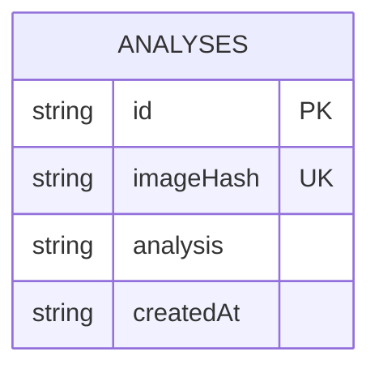

# Database Schema

## Overview

SmartBite uses SQLite with the `better-sqlite3` library for persistent storage of cached analysis results. The database is designed to be simple yet effective for the application's needs.

## Schema Diagram



## Table: analyses

### Description
Stores cached results of image analyses for quick retrieval of previously processed images.

### Columns

| Column Name | Type | Constraints | Description |
|-------------|------|-------------|-------------|
| id | TEXT | PRIMARY KEY | Unique identifier for the analysis record |
| imageHash | TEXT | UNIQUE, NOT NULL | SHA-256 hash of the image content |
| analysis | TEXT | NOT NULL | JSON string representation of the analysis results |
| createdAt | TEXT | NOT NULL | ISO 8601 timestamp of when the analysis was created |

### Indexes

1. **Primary Key Index** on `id`
2. **Unique Index** on `imageHash`

### SQL Definition

```sql
CREATE TABLE IF NOT EXISTS analyses (
  id TEXT PRIMARY KEY,
  imageHash TEXT UNIQUE NOT NULL,
  analysis TEXT NOT NULL,
  createdAt TEXT NOT NULL
)
```

## Data Flow

### Insertion
When a new image is analyzed and not found in the cache:
1. Generate SHA-256 hash of the image content
2. Convert analysis result to JSON string
3. Insert record with generated ID, image hash, JSON analysis, and current timestamp

### Retrieval
When checking for cached results:
1. Generate SHA-256 hash of the image content
2. Query for record with matching imageHash
3. If found, parse JSON analysis string back to object
4. Return cached results

### Updates
The system uses `INSERT OR REPLACE` to handle cases where the same image might be analyzed again:
1. If a record with the same imageHash exists, it will be replaced
2. This ensures the most recent analysis is always stored

## Database Location

The SQLite database file is stored at:
```
data/analyses.db
```

The `data` directory is created relative to the application's working directory if it doesn't exist.

## Database Service Interface

### Methods

#### generateImageHash(buffer: ArrayBuffer): string
Generates a SHA-256 hash of the provided image buffer.

#### saveAnalysis(imageHash: string, analysis: any): string
Saves an analysis result to the database and returns the generated ID.

#### findAnalysisByImageHash(imageHash: string): AnalysisRecord | null
Finds an analysis record by image hash, returning null if not found.

#### getAnalysisById(id: string): AnalysisRecord | null
Finds an analysis record by ID, returning null if not found.

#### getAllAnalyses(): AnalysisRecord[]
Returns all analysis records in the database.

#### close(): void
Closes the database connection.

## Data Model

### AnalysisRecord
```typescript
type AnalysisRecord = {
  id: string;           // Unique identifier
  imageHash: string;    // SHA-256 hash of image content
  analysis: string;     // JSON string of analysis results
  createdAt: string;    // ISO 8601 timestamp
}
```

## Performance Considerations

1. **Indexing**: The unique constraint on `imageHash` creates an index for fast lookups
2. **Storage**: JSON strings are stored directly for simplicity
3. **Concurrency**: SQLite handles concurrent reads well, but writes may block
4. **Size**: No automatic cleanup; database will grow over time

## Backup and Recovery

Since the cache is a performance optimization rather than critical data:
1. Database can be safely deleted if needed
2. Cache will rebuild naturally as users analyze images
3. No backup strategy is implemented

## Security

1. **Data Isolation**: Analysis data contains no personal information
2. **Access Control**: Database is only accessed by the application
3. **Input Validation**: Image hashes are generated internally, not accepted from user input