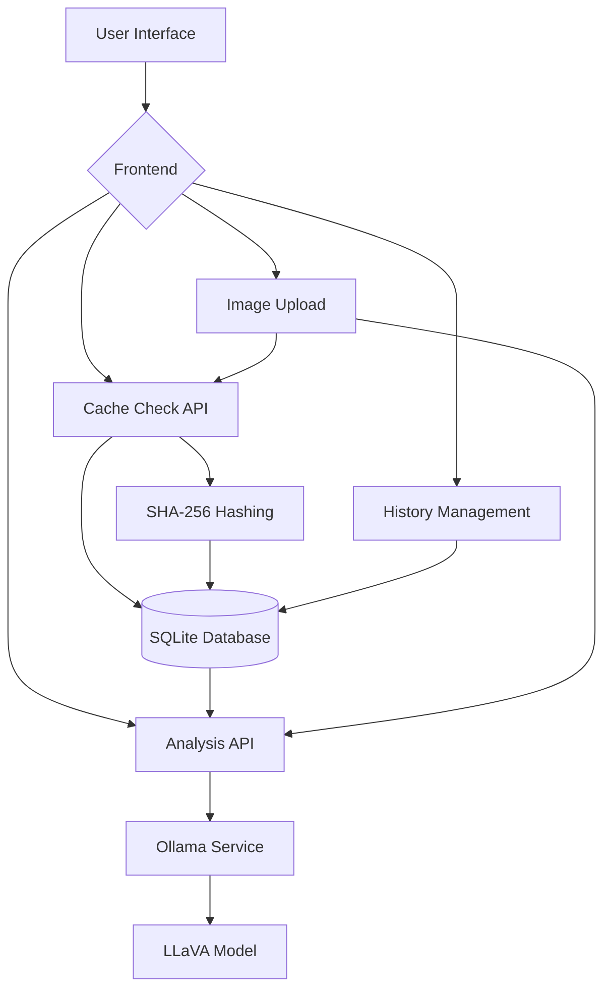

# System Overview

## Introduction

SmartBite is an AI-powered food analysis application that identifies dishes, ingredients, nutritional information, and provides recipes from uploaded food images. The system combines modern web technologies with local AI processing to deliver a seamless user experience.

## Key Features

1. **Image Upload and Preview**
   - Drag-and-drop interface for PNG, JPG, JPEG files
   - Real-time image preview using FileReader API
   - File type validation and error handling

2. **AI Image Analysis**
   - Integration with Ollama for local AI processing
   - LLaVA vision model for image understanding
   - Structured output of dish information, ingredients, nutrition, and recipes

3. **Duplicate Detection and Caching**
   - SHA-256 image hashing for duplicate identification
   - Server-side SQLite database for persistent caching
   - Instant retrieval of previously analyzed images

4. **User Interface**
   - Responsive design with glassmorphism aesthetic
   - Dark/light mode toggle
   - History tracking of saved analyses
   - Animated transitions and loading states

## Technology Stack

### Frontend
- **Framework**: Next.js 14 (App Router)
- **Language**: TypeScript
- **Styling**: Tailwind CSS with utility-first approach
- **UI Components**: Lucide React icons, Motion for animations
- **State Management**: React hooks (useState, useEffect, etc.)

### Backend
- **Runtime**: Node.js
- **API**: Next.js API routes
- **Database**: SQLite with better-sqlite3
- **Caching**: SHA-256 image hashing

### AI Processing
- **Runtime**: Ollama for local LLM execution
- **Vision Model**: LLaVA 7B for image analysis
- **Communication**: HTTP API calls to Ollama service

## Architecture Diagram

## Data Flow

1. **Image Upload**: User uploads a food image through the UI
2. **Cache Check**: System generates SHA-256 hash and checks database for existing analysis
3. **Cache Hit**: If found, immediately display cached results
4. **Cache Miss**: Send image to Ollama for analysis
5. **AI Processing**: Ollama processes image and returns structured data
6. **Result Display**: Show analysis results to user
7. **Caching**: Store results in database with image hash
8. **History**: Save to user history (localStorage)

## Security Considerations

- All image processing happens locally (no external services)
- User data stored in browser localStorage (client-side only)
- Cached results stored server-side in SQLite database
- No personal information collected or stored

## Performance Optimization

- Duplicate detection prevents redundant AI processing
- Server-side caching provides instant results for known images
- Client-side history for quick access to previously viewed results
- Progress indicators during AI processing